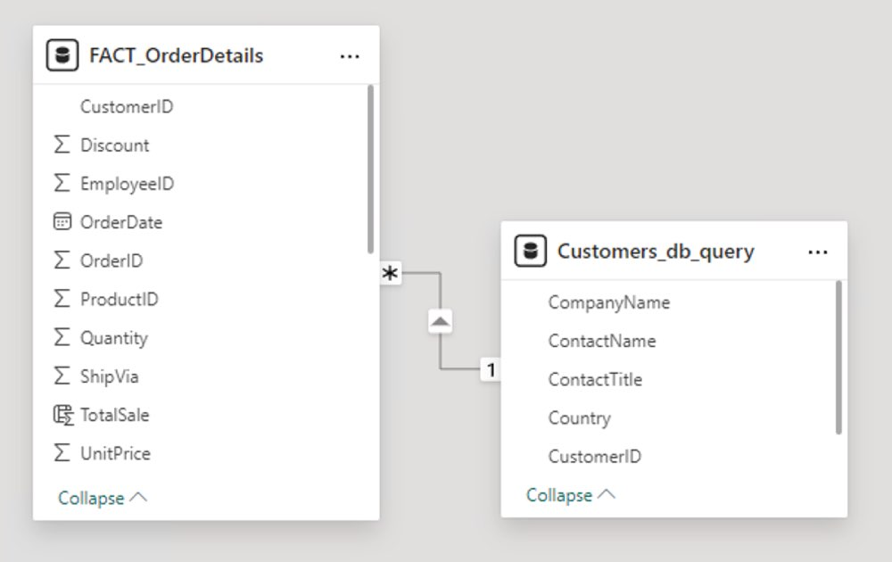
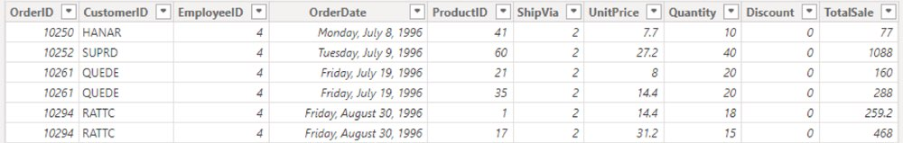
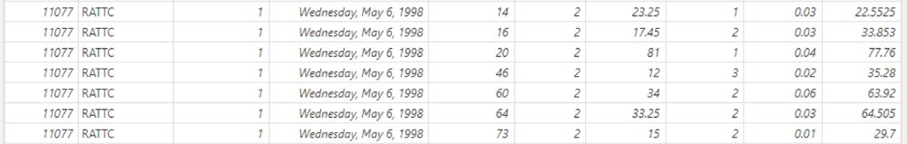
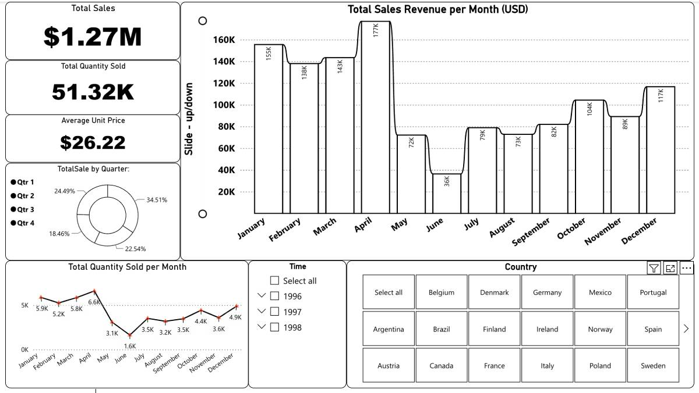
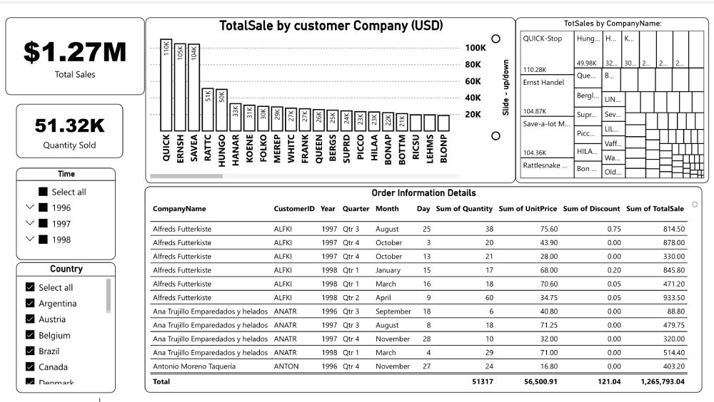
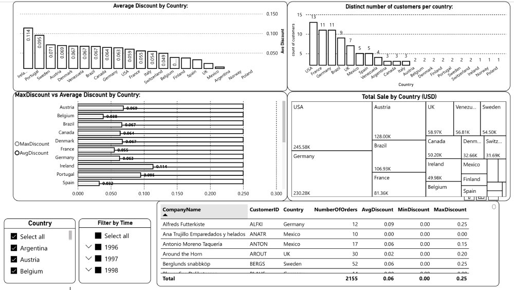

# Power BI Assignment (75 points total)

This assignment exercises the basics of Power BI. You will use two cloud based data sources - SQL and Azure storage - to build a basic data model. Then you will create some visualizations based on simulated real world needs.

## Part 1 - Set up - 30 points

1. Download the Power BI desktop application from https://www.microsoft.com/en-us/download/details.aspx?id=58494. Install it.

2. Upload the FACT_OrderDetails.csv file from the InputData folder in this repo to a new path in your storage account in Azure. Reusing the storage account and container used in previous assignments is fine.

3. Open Power BI Desktop and save a file named "NorthwindsAnalysis.pbix" in the Analytics folder.

4. Get data for two datasets into the report:

   - Dataset 1 is the FACT_OrderDetails.csv that you just uploaded to Azure. While you could access this file locally, the expectation is that you do it from Azure. This type of access is aligned with what many of you will need for your project.
   - Dataset 2 is the Customer table in the SQL Server instance created for the last assignment. Write a query to retrieve the CustomerID, CompanyName, Contact Name, ContactTitle, and Country from the database.

     ```
     SELECT
         CompanyName,
         ContactName,
         ContactTitle,
         Country,
         CustomerID
     FROM
         dbo.Customers;
     ```

5. In the data modeling area of PowerBI, set up a `1:many` relationship beteween the `Customer` table and the `FACT_OrderDetails` table using CustomerId as the key. Note that PowerBI may automatically find this relationship.

   <p align ="center">  </p>

6. In the FACT_OrderDetails table, create a new column titled TotalSale based on the UnitPrice, Quantity, and Discount.

<p align ="center">  </p>
<p align ="center"> ... </p>
<p align ="center">  </p>

7. Save the Power BI desktop file.

## Part 2 - Build reporting

Create the following pages to enable your business partners. The scenarios will give you opportunities for one or more line plots, bar charts or tree maps, tables, scatter plots, and filters. Try to incorporate all of these and/or other visualizations for your business partners.

### Page 1 - CFO - 15 points

As the Chief Financial Officer, I want to see how the business is trending over time in terms of total sales and quantity of products. I want to easily filter by time and customer country.

<p align ="center">  </p>

### Page 2 - Sales, Customer (aka Company) focus - 15 points

As the Sales Manager, I want to know how the various customer (company) countries are performing and who my best customers are in each country. On the same page, I want to see the detailed order information (company, id, date, quantity, price, discount, total sale) for each customer. I want to easily filter by time and customer country. The primary metric that I'm interested in is total sales. I want to easily filter by time and customer country.

<p align ="center">  </p>

### Page 3 - Sales, Discount focus - 15 points

As the Sales Manager, I want to see if my sales team is offering higher discounts in specific countries and/or to specific customers. This might indicate sales people that are offering better discounts to certain customers and/or padding their sales totals at the expense of company profitability.

- I would like a summary plot that shows average discount, total sales, and distint number of customers in each country.
- I would also like a table showing the number of orders, average discount, minimum discount, and maximum discount for each customer for each country on the page. This table should be interactive with the summary plot (i.e. clicking on a country in the summary plot should filter the table).
- I want to easily filter by time and country.
<p align ="center">  </p>

### Submission

Save your Power BI desktop file in the designated repo location, commit, and push.

No Blackboard submission is required.
